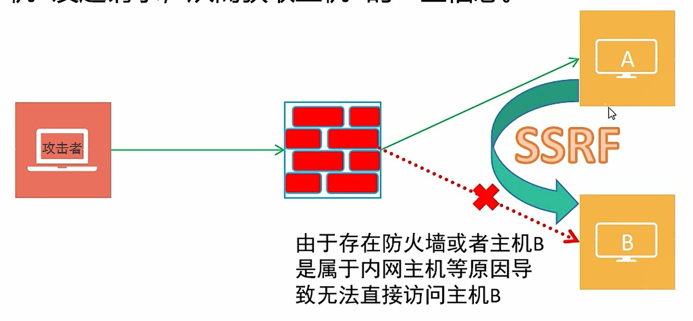
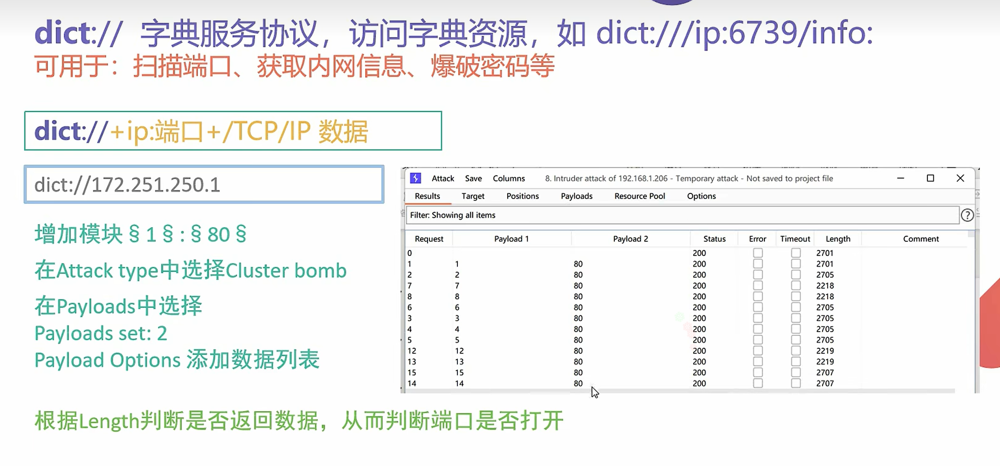
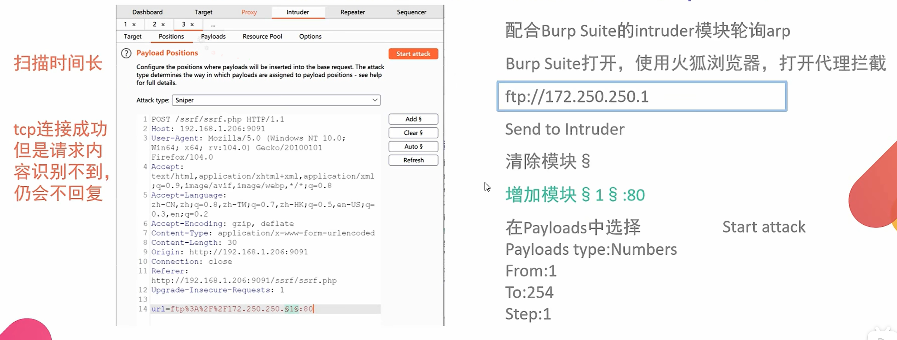
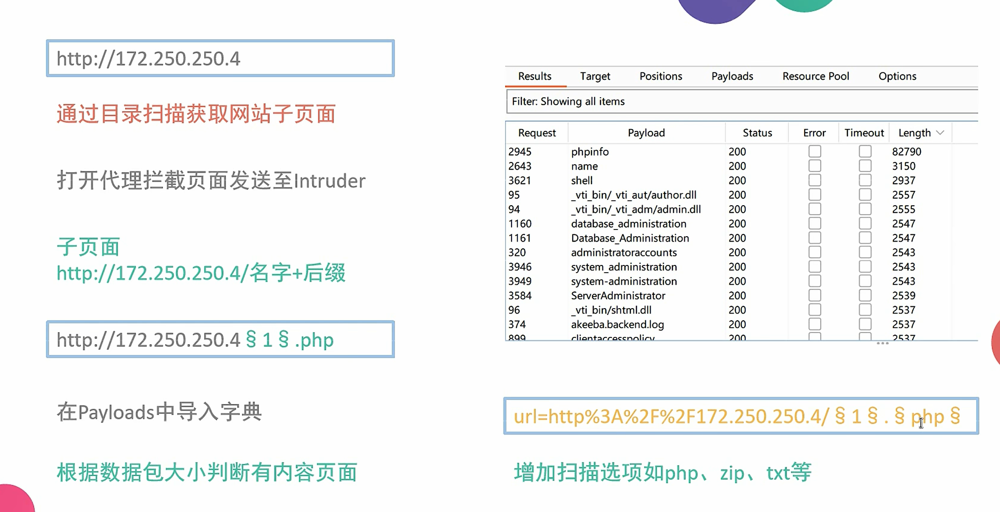
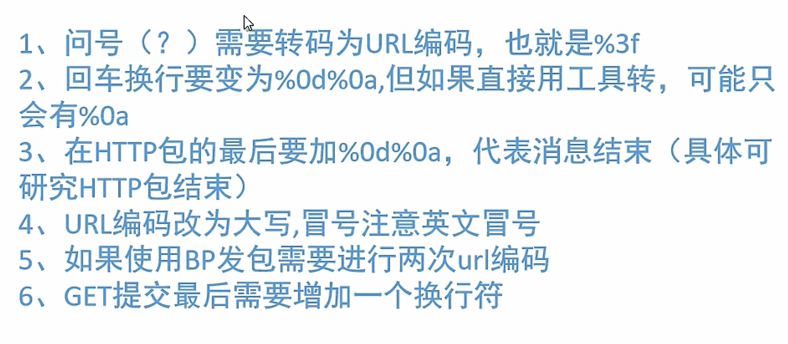
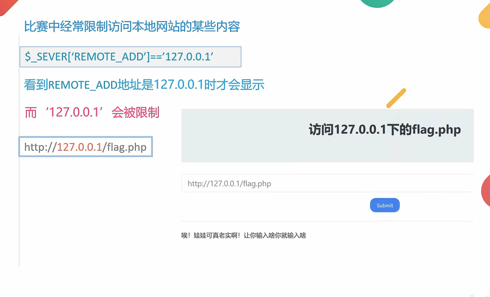

# SSRF(service side request forgery)

## 漏洞原理

> 服务器请求伪造是一种由攻击者形成服务器端发起的安全漏洞，本质上是属于信息泄露漏洞

**攻击的目标：**

从外网无法访问的内部系统

**形成的原因：**

大部分是由于服务端提供了从其他服务器应用获取数据的功能，且没有对目标地址做过滤与限制

* 从指定URL地址获取网页文本内容
* 加载指定地址的图片，下载
* 百度识图，给出一串URL就能识别出图片

**攻击方式：**

借助主机A来发起SSRF攻击，通过主机A向主机B发起请求，从而获取主机B的一些信息



## 伪协议

> 伪协议：
>
> * file://
>
>   从文件系统中获取文件内容，如file:///etc/passwd
>
>   1. file:///etc/passwd
>
>      读取文件passwd
>
>   2. file:///etc/hosts
>
>      显示当前操作系统网卡的IP
>
>   3. file:///proc/net/arp
>
>      显示arp缓存表（寻找内网其他主机）
>
>   4. file:///proc/net/fib_trie
>
>      显示当前网段路由信息
>
> * dict://
>
>   字典服务协议，访问字典资源，如dict:///ip:6739/info:
>
>   效率比ftp要高
>
>   
>
>   获取网站信息dict:///172.251.250.10/info
>
> * ftp://
>
>   可用于网络端口扫描
>
>   
>
> * sftp://
>
>   SSH文件传输协议或安全文件传输协议
>
> * ldap://
>
>   轻量级目录访问协议
>
> * tftp://
>
>   简单文件传输协议
>
> * gopher://
>
>   分布式文档传递服务

## HTTP伪协议

作用：常规URL形式，允许通过HTTP1.0的GET方法，以只读访问文件或者资源，CTF中通常用于远程包含

1. 查找内网存活主机----->file
2. 查找内网主机开发端口——–>dict
3. 目录扫描———>http



## gopher伪协议

利用范围较广：

* GET提交
* POST提交
* redis
* Fastcgi
* sql

基本格式：

> URL:gopher://\<host>:\<post>/\<gopher-path>

web也需要加端口号80

gopher协议默认端口为70

> 发送端：curl gopher://127.0.0.1:7777/abcd
>
> 接收端：bcd

gopher请求不转发第一个字符

> curl gopher://127.0.0.1:7777/_abcd

使用下划线填充首位

**GET提交**

> 需要保留头部信息：
>
> 1. 路径：GET /name.php?php?name=benben HTTP/1.1
> 2. 目标IP地址：Host: 172.250.250.4
> 3. 最后加一个换行

```
gopher://172.250.250.4:80/_GET%20/name.php%3fname=benben%20HTTP/1.1%0d%0AHost:%20172.250.250.4%0d%0A
URL编码：
空格 %20
问号 %3f
换行符 %0d%0A
```



**POST提交**

> 需要保留头部信息
>
> 1. POST
> 2. Host:
> 3. Content-Type:
> 4. Content-Length:

```
gopher://172.250.250.4:80/_POST%20/name.php%20HTTP/1.1%0d%0AHost:%20172.250.250.4%0d%0AContent-Type:%20application/x-www-form-urlencoded%0d%0AContent-Length:%2013%0d%0A%0d%0Aname=benben
```

## SSRF使用其他进制绕过127限制


